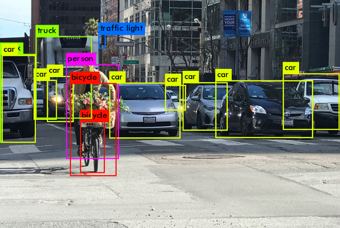

## A Simple Semi-Supervised Learning Framework for Object Detection
### Reference:(https://arxiv.org/pdf/2005.04757.pdf)

#### Abstract:

A semi-supervised learning is a learning technique which is often used when there is very less labeled data and a huge set of unlabeled data. The idea is to use the labeled dataset to label the unlabeled dataset. Semi supervised learnig is used to increase the perfomance of the machine learning models, but so far it has been used only for image classification task. In this paper, SSL is been applied to detect objects of unlabeled images. A new data augmentation strategy has been employed in this paper. The performance of semi supervised object detection is evaluated using the MS-COCO dataset and VOC07 dataset.





### Setting global enviroment variables.

```bash
export PRJROOT=/path/to/your/project/directory/STAC
export DATAROOT=/path/to/your/dataroot
export COCODIR=$DATAROOT/coco
export VOCDIR=$DATAROOT/voc
```

### Install virtual environment in the root folder of the project

- sudo apt install python3-dev python3-virtualenv python3-tk imagemagick
- virtualenv -p python3 --system-site-packages env3
- . env3/bin/activate
- pip install -r requirements.txt

### Check the tensorflow version
python -c 'import tensorflow as tf; print(tf.__version__)'

### install coco dataset using apis
pip3 install 'git+https://github.com/cocodataset/cocoapi.git#subdirectory=PythonAPI'


### Training

There are three steps:
- __1.__ Train a standard detector on labeled data

- __2.__ Predict pseudo boxes and labels of unlabeled
data using the trained detector 
- __3.__ Use labeled data and unlabeled data with
pseudo labels to train a STAC detector


The following example use labeled data as 10% train2017 and rest 90% train2017 data
as unlabeled data.

### Step 0: Set variables

```bash
/detection

# Labeled and Unlabeled datasets
DATASET=coco_train2017.1@10
UNLABELED_DATASET=${DATASET}-unlabeled

# PATH to save trained models
CKPT_PATH=result/${DATASET}

# PATH to save pseudo labels for unlabeled data
PSEUDO_PATH=${CKPT_PATH}/PSEUDO_DATA

# Train with 8 GPUs
export CUDA_VISIBLE_DEVICES=0,1,2,3,4,5,6,7
```

### Step 1: Train FasterRCNN on labeled data

`. scripts/coco/train_stg1.sh`.

Set `TRAIN.AUGTYPE_LAB=strong` to apply strong data augmentation.

```bash
# --simple_path makes train_log/${DATASET}/${EXPNAME} as exact location to save
python3 train_stg1.py \
    --logdir ${CKPT_PATH} --simple_path --config \
    BACKBONE.WEIGHTS=${COCODIR}/ImageNet-R50-AlignPadding.npz \
    DATA.BASEDIR=${COCODIR} \
    DATA.TRAIN="('${DATASET}',)" \
    MODE_MASK=False \
    FRCNN.BATCH_PER_IM=64 \
    PREPROC.TRAIN_SHORT_EDGE_SIZE="[500,800]" \
    TRAIN.EVAL_PERIOD=20 \
    TRAIN.AUGTYPE_LAB='default'
```

### Step 2: Generate pseudo labels of unlabeled data

`. scripts/coco/eval_stg1.sh`.

### Evaluate using COCO metrics and save eval.json

```bash
# Check pseudo path
if [ ! -d ${PSEUDO_PATH} ]; then
    mkdir -p ${PSEUDO_PATH}
fi

# Evaluate the model for sanity check
# model-180000 is the last checkpoint
# save eval.json at $PSEUDO_PATH

python3 predict.py \
    --evaluate ${PSEUDO_PATH}/eval.json \
    --load "${CKPT_PATH}"/model-180000 \
    --config \
    DATA.BASEDIR=${COCODIR} \
    DATA.TRAIN="('${UNLABELED_DATASET}',)"
```

### Generate pseudo labels for unlabeled data

Set `EVAL.PSEUDO_INFERENCE=True` to use original images rather than resized ones for inference.

```bash
# Extract pseudo label
python3 predict.py \
    --predict_unlabeled ${PSEUDO_PATH} \
    --load "${CKPT_PATH}"/model-180000 \
    --config \
    DATA.BASEDIR=${COCODIR} \
    DATA.TRAIN="('${UNLABELED_DATASET}',)" \
    EVAL.PSEUDO_INFERENCE=True
```

### Step 3: Train STAC

`. scripts/coco/train_stg2.sh`.

The dataloader loads pseudo labels from `${PSEUDO_PATH}/pseudo_data.npy`.

Apply `default` augmentation on labeled data and `strong` augmentation on unlabeled data.

`TRAIN.CONFIDENCE` and `TRAIN.WU` are two major parameters of the method.

```bash
python3 train_stg2.py \
    --logdir=${CKPT_PATH}/STAC --simple_path \
    --pseudo_path=${PSEUDO_PATH} \
    --config \
    BACKBONE.WEIGHTS=${COCODIR}/ImageNet-R50-AlignPadding.npz \
    DATA.BASEDIR=${COCODIR} \
    DATA.TRAIN="('${DATASET}',)" \
    DATA.UNLABEL="('${UNLABELED_DATASET}',)" \
    MODE_MASK=False \
    FRCNN.BATCH_PER_IM=64 \
    PREPROC.TRAIN_SHORT_EDGE_SIZE="[500,800]" \
    TRAIN.EVAL_PERIOD=20 \
    TRAIN.AUGTYPE_LAB='default' \
    TRAIN.AUGTYPE='strong' \
    TRAIN.CONFIDENCE=0.9 \
    TRAIN.WU=2
```

### Tensorboard

All training logs and tensorboard info are under
`/detection/train_log`. Visualize using
```bash
tensorboard --logdir=/detection/train_log
```
